# 用户使用手册

### 免责声明
本人出于学习 python 网络爬虫目的编写此程序，本程序仅供学习和研究使用，不得用于任何商业用途。用户在使用本程序时，必须遵守当地的法律法规。如果用户使用本程序进行任何非法行为，用户需自行承担相应后果，与本程序作者无关。本程序作者不对用户使用本程序造成的任何直接或间接损失负责。使用本程序即表示接受此免责声明。

## 0. 注意事项
在 `市集.exe` 程序所在的文件夹下，你需要检查是否有如下的文件或文件夹，如果没有你需要自己加上
+ 文件夹 `db`：用来存放数据库文件，它可以是空的，但不能没有
+ 文件 `cookie.txt`：你需要在这个文件里面放你的 cookie（详见下面 1.1）
+ 文件 `dbconfig`：如果你使用 sqlite 数据库，你不需要它

## 1. 抓取数据
### 1.0 无脑省流版
+ 步骤1：打开 `cookie.txt`，输入你的 cookie（详见下面 1.1）
+ 步骤2：双击 市集.exe 运行程序，首先你会被要求“请选择分类”，如果你想要获取手办的数据，输入 "fig" 后回车或者直接回车；如果你想要获取周边（很多大礼包也会在“周边”中）的数据，输入 "peri" 后回车；后面三个选项都直接回车
+ 步骤3：等着，程序会自动抓取网站上的数据，存入本地的数据库
+ 步骤4：出现“自动重连失败”的提示后，输入 "c" 后回车；如果频繁出现“自动重连失败”，先重置网络（断开wifi重连，换一个wifi，使用全局代理，等），然后输入 "c" 后回车

### 1.1 配置 cookie
在 cookie.txt 文件中，放入你的cookie，结尾不要有多余的空格或换行。一般来说，B站市集的 cookie 获取一次能用几天到一两周，如果提示“Cookie 无效”，你需要再次获取一次。

#### 如何获取自己的cookie
用电脑的网页浏览器打开[B站市集](https://mall.bilibili.com/neul-next/index.html?page=magic-market_index)，我们要获取的就是这个网站的 cookie，你也可以上网自行查找如何获取一个网站的 cookie，网络上能查到的一些常见方法在这里有可能行不通，建议使用下面介绍的方法。

如果你使用的是 edge 浏览器或谷歌浏览器，你可以完全跟着下面的步骤做，如果你使用的是其他的浏览器，操作也应该类似。
1. 在网页中鼠标单击右键，单击“检查”（或者直接快捷键 F12），页面右侧会出现一个窗口
    |edge 浏览器|谷歌浏览器|
    |-|-|
    ||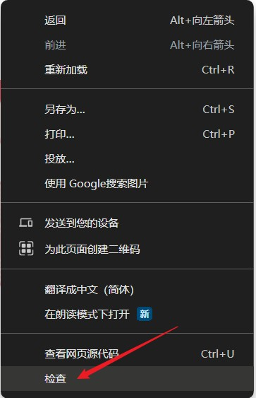|

2. 在右侧窗口上方的菜单栏中，找到“网络”（Network）选项
    |edge 浏览器|谷歌浏览器|
    |-|-|
    |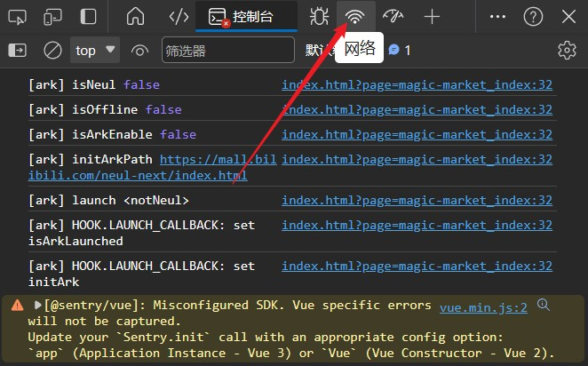|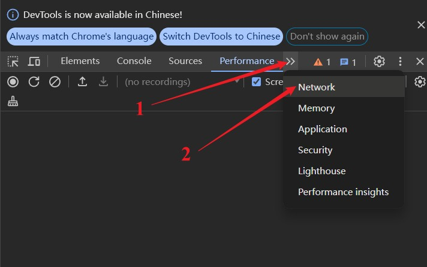|

3. 选中“网络”选项后，刷新网页，右侧会刷出很多记录，找到最上面第一条记录，单击打开
    |edge 浏览器|谷歌浏览器|
    |-|-|
    |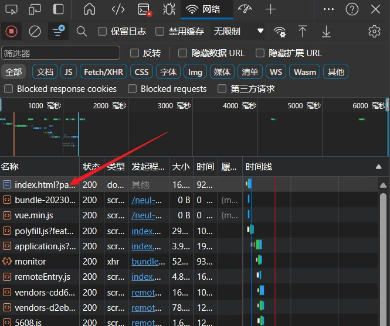|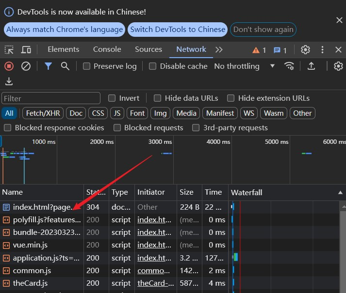|

4. 选中“标头”（Header），然后找到 "Cookie" 这一栏，复制里面的这一堆内容，粘贴到我们的 `cookie.txt` 中，注意复制的时候不要多复制或漏复制内容，粘贴完后记得保存
    |edge 浏览器|谷歌浏览器|
    |-|-|
    |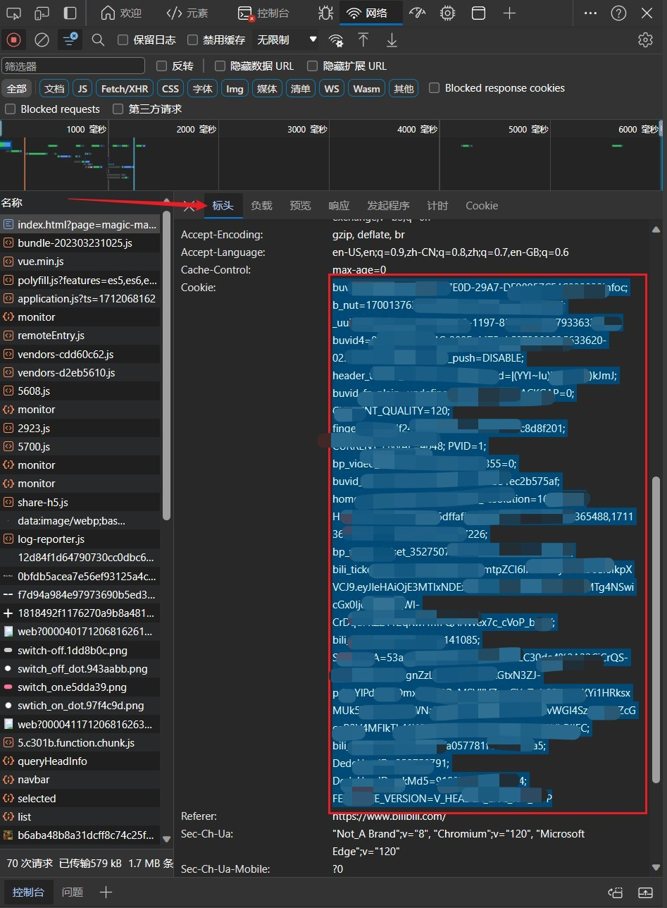|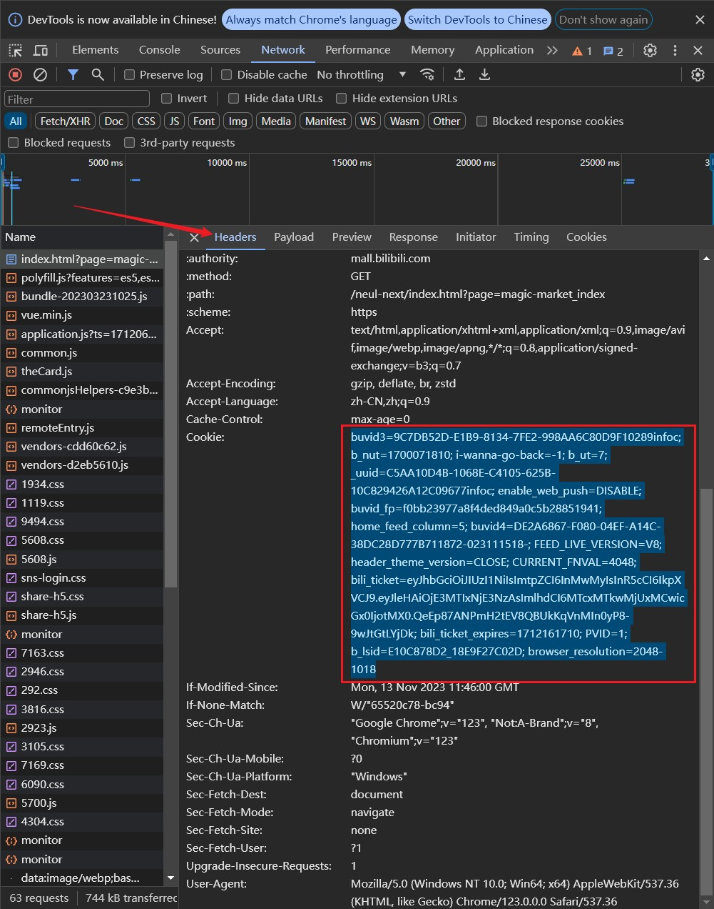|

### 1.2 程序选项
双击 `市集.exe` 运行程序，会有三个选项需要设置（如果选择默认，直接回车）
1. 请选择分类
    + all: 所有商品
    + fig: 手办（默认）
    + model: 模型
    + peri: 周边（其中包括了大量的大礼包）
    + 3C: 3C
    + gacha: 盲盒
2. 请选择排序方式
    请选择默认的 **“时间降序”，不要选其他的**，即直接回车即可
3. 请选择获取数据的方式（建议使用默认的merge）
    + pull: 只抓取新的数据
    + merge: 抓取全部数据（默认）
4. 请选择使用的数据库
    目前只支持 sqlite 和 mysql 两种数据库（默认 sqlite）
    + 如果你的电脑（或你的服务器）上安装了 mysql，更推荐使用 mysql，在 "dbconfig.txt" 文件中按照模板填写数据库配置
    + 不熟悉数据库（特别是不会写 sql 代码）的用户，推荐你使用更轻量级的 sqlite 数据库，可以用附带的专用软件 DB Browser for SQLite 查询数据库（详细介绍见后面）

### 1.3 风控处理
开始抓取数据后，可能会遇到风控（这是因为短时间内请求过多，服务器拒绝了访问）
遇到风控后，程序首先会尝试自动重连，如果自动重连失败，用户需要输入一个对应的字母，决定下一步的操作：
+ c: 再次尝试重连，或者也可以先手动重置网络连接（断开网络再连上 / 切换wifi / 使用代理，注意要全局代理 / 等其他），再尝试重连
+ q: 撤销本次抓取
+ f: 如果已经抓取到的记录较多（大于5000），不推荐使用
+ m: 如果已经抓取到的记录较少（小于5000），不推荐使用

一般来说，只用c即可，手动重置网络后基本都能继续稳定运行较长一段时间

----------------------------------------

## 2. 结果查询

### 2.0 无脑省流版
1. 双击打开 `数据库.exe`
2. 点击“打开数据库”，找到 `市集.exe` 所在的文件夹，进入子文件夹 `db`，选择 `Bmarket.db` 打开

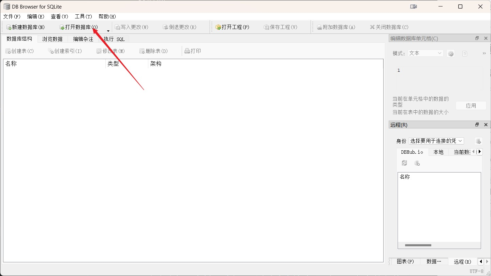

3. 点击“浏览数据”，查看数据表

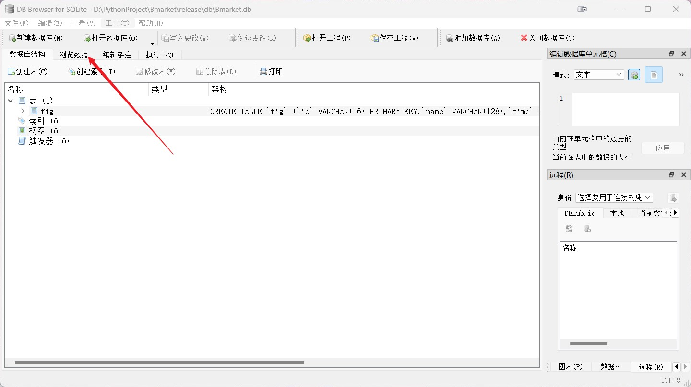

4. 可以在“表”处切换要查看的数据表（手办的数据在 `fig` 中，周边的数据在 `peri` 中）

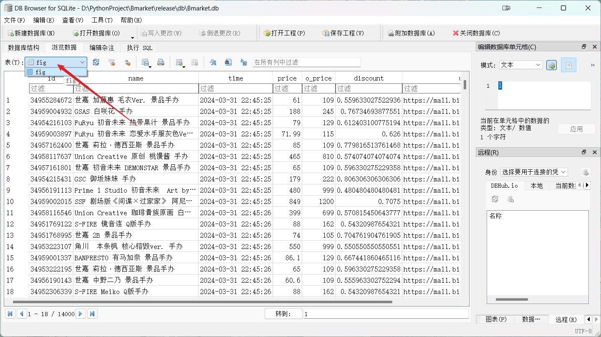

5. 可以在表的列名处单击，指定按照这个列排序；可以在列名下面的文本框中输入进行搜索

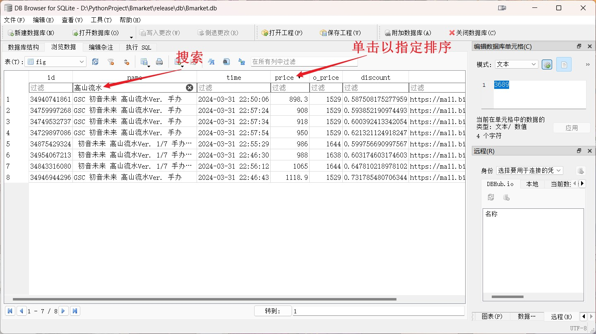

6. 可以在文本框中右键单击，选择“设置过滤表达式”，实现更复杂的筛选条件

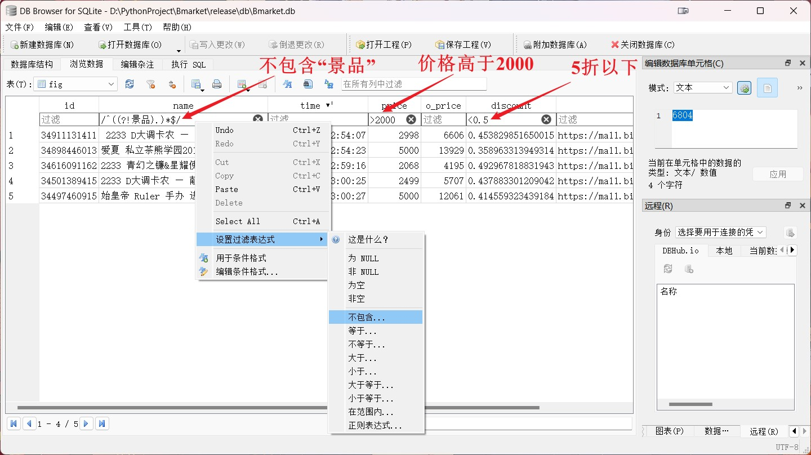

7. 想要查看某个商品的详情，把其 "url" 列的内容复制到浏览器网址，即可查看

### 2.1 一些说明
在文件夹 `DB Browser for SQLite` 中附带了一个 sqlite 数据库浏览器，`数据库.exe` 实际上就是其中 `DB Browser for SQLite.exe` 的快捷方式，它实际上是一个独立的软件包，所以`DB Browser for SQLite` 这整个文件夹其实可以自由地直接迁移
