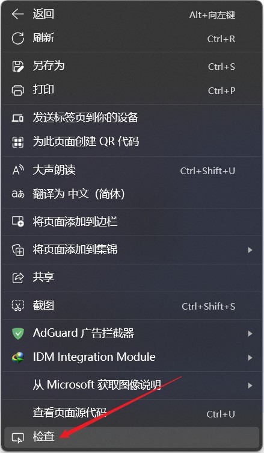
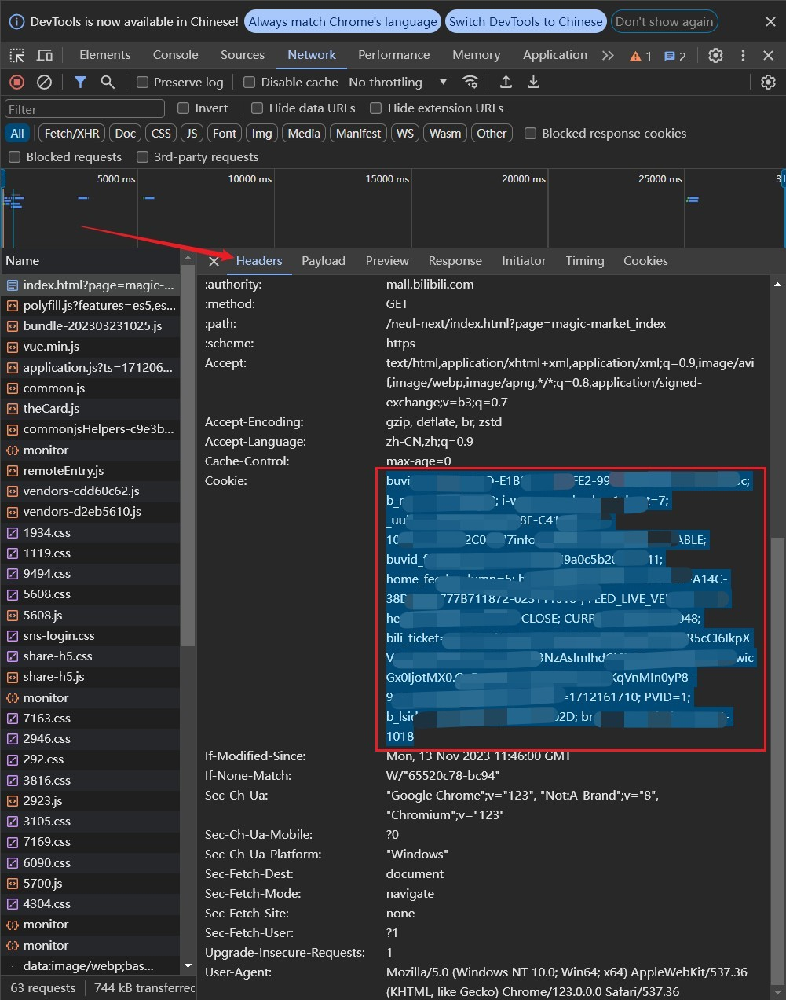

# 用户使用手册

### 免责声明
本人仅出于学习 python 网络爬虫目的编写此程序。用户在使用本程序时，必须遵守当地的法律法规。如果用户使用本程序进行任何非法行为，用户需自行承担相应后果，与本程序作者无关。本程序作者不对用户使用本程序造成的任何直接或间接损失负责。使用本程序即表示接受此免责声明。

## 建议
[2025.6] 最新的风控政策已不再会导致断连，仅在爬取过于频繁时获取不到更多商品（提示“没有更多商品了”，且一旦触发，就无法从当前进度继续爬取）。因此，配置 Clash 切换代理已基本无实际意义，唯一有用的就是设置更大的爬取时间间隔，建议的爬取时间间隔为 2 秒。

## 0. 编译和打包
所有源代码都在目录 `src` 中，主程序为 `App.py`，且已经提供了打包使用的图标文件 `icon.png`（你也可以使用你自己喜欢的图标）。在目录 `release` 中已经提供了可以在 Windows 下直接运行的程序，发行版目前也只支持 Windows，如果你需要打包可以使用以下命令 ~~（相信强大的 Mac 用户和 Linux 用户可以自己解决）~~
```sh
PyInstaller -F -w -i icon.png App.py
```

另外注意，`src/image` 中含有一些内置图片文件，需要将 `image` 目录与打包后的 exe 可执行文件放在同目录下。

## 1. 抓取商品信息

### 1.1 配置 cookie
支持自动获取 cookie，目前仅稳定支持 Edge 浏览器，当你在 Edge 浏览器中登录 B 站后，程序可以自动获取 cookie。

如果你使用其他浏览器或自动获取失败，你需要去手动获取：在“编辑Cookie”按钮中输入你的 cookie。一般来说，B站市集的 cookie 获取一次能用几天到一两周，如果提示“Cookie 无效”，你需要再次获取一次。

#### 如何手动获取自己的cookie
用电脑的网页浏览器打开[B站市集](https://mall.bilibili.com/neul-next/index.html?page=magic-market_index)，我们要获取的就是这个网站的 cookie，你也可以上网自行查找如何获取一个网站的 cookie，网络上能查到的一些常见方法在这里有可能行不通，建议使用下面介绍的方法。

如果你使用的是 edge 浏览器或谷歌浏览器，你可以完全跟着下面的步骤做，如果你使用的是其他的浏览器，操作也应该类似。
1. 在网页中鼠标单击右键，单击“检查”（或者直接快捷键 F12），页面右侧会出现一个窗口
    |edge 浏览器|谷歌浏览器|
    |-|-|
    |||

2. 在右侧窗口上方的菜单栏中，找到“网络”（Network）选项
    |edge 浏览器|谷歌浏览器|
    |-|-|
    |||

3. 选中“网络”选项后，刷新网页，右侧会刷出很多记录，找到最上面第一条记录，单击打开
    |edge 浏览器|谷歌浏览器|
    |-|-|
    |||

4. 选中“标头”（Headers），然后找到 "Cookie" 这一栏，复制里面的这一堆内容，点击 Bmarket 界面的“编辑 Cookie”按钮，粘贴进去。
    |edge 浏览器|谷歌浏览器|
    |-|-|
    |||

<div align=center>

</div>

### 1.2 配置 MySQL
如果你使用 MySQL（你希望将爬到的记录存进 MySQL 数据库中），你需要点击“配置MySQL”按钮完成配置。

### 1.3 配置 Clash
如果你想在发生风控导致重连失败时使用 Clash 自动切换代理，你需要完成以下配置
#### Clash 规则添加（建议）
**建议**你在 Clash 中添加一条针对市集域名 `mall.bilibili.com` 的规则，并使用你不常用的 Selector（比如 Spotify, Telegram, PayPal），这样切换代理就可以仅针对市集这一个网站，不会影响程序运行期间你的其他上网行为

添加规则最简单的方法是：打开 Clash 界面 - 配置 - 右键你使用的订阅 - 编辑文件，找到 `rules:`，在下面第一行仿照着添加一行 `- 'DOMAIN,mall.bilibili.com,PayPal'`（这里 `PayPal` 请替换成你实际使用的 Selector），然后保存，重启 Clash

你有可能在你的 Clash 中找不到上面所述的界面，这样，你可以通过“配置 - 应用目录”打开应用目录，然后进入 `profiles` 目录，用记事本打开其中的 yaml 配置文件（如果你有多个订阅，你可能需要找一找哪个是你使用的），找到 `rules:`，在下面第一行仿照着添加一行 `- 'DOMAIN,mall.bilibili.com,PayPal'`（这里 `PayPal` 请替换成你实际使用的 Selector），然后保存，重启 Clash

使用上面介绍的添加规则的方法，**会在订阅更新后失效**，所以你可以取消自动更新订阅，或者在订阅更新后重新做上面的操作。你也可以在网上查阅其他更好的添加规则的方法，使其在订阅更新后不会失效。

#### 不使用规则
实际上，你也可以不添加新规则。在 Clash 现有规则下，市集作为国内网站会走直连，在规则模式下我们切换代理就没有任何作用。所以，**如果你不添加新规则，你必须使用全局代理。**
这意味着程序运行期间，自动切换代理会直接修改全局代理，而同时你的 Clash 必须使用全局代理，这可能会影响你使用浏览器等其他的上网行为。

#### 配置 Clash 连接参数
打开 Bmarket 程序后，点击“配置Clash”按钮进行 Clash 连接参数配置。一般来说，Clash 的主机地址默认为 `localhost`，（通信）端口号默认为 `9090`，密钥默认为空，除非你知道它们的含义，且你修改过它们，否则请使用默认值。Selector 你需要填写你使用的 Selector **（如果你不使用规则，而使用全局代理，Selector 填写 `GLOBAL`）**

### 1.4 程序选项
打开 Bmarket 程序后，会有5个选项需要设置
1. 商品类型
2. 排序方式
    **如果你的插入数据库方式使用 `新增`，排序方式请选择 `时间降序（推荐）`，不要选择其他的**
3. 插入数据库方式
    + `合并`: 抓取全部商品记录，并合并到现有记录中，原有的已失效商品会被删除
    + `新增`: 只抓取新的商品记录（抓取到已有记录中存在的商品为止），原有的已失效商品**不会被删除** **（如果你使用 `新增`，排序方式请选择 `时间降序（推荐）`，不要选择其他的）**
    
4. 将记录插入数据库
    目前只支持 MySQL 和 SQLite 两种数据库
    + 如果你的电脑（或你的服务器）上安装了 MySQL，更推荐使用 MySQL（[详见上面 1.2](#12-配置-mysql)）
    + 不熟悉数据库（特别是不会写 sql 代码）的用户，推荐你使用更轻量级的 SQLite 数据库，可以用附带的专用软件 DB Browser for SQLite 查询数据库（详细介绍见后面）
5. 风控时自动使用 Clash 切换代理
    目前只支持使用 Clash 自动切换代理，如果你勾选了这个功能你需要完成相关的 Clash 配置（[详见上面 1.3](#13-配置-clash)）

### 1.5 风控处理
开始抓取数据后，可能会遇到风控（这是因为短时间内请求过多，服务器拒绝了访问）
遇到风控后，程序首先会尝试自动重连。自动重连失败时，如果你启用了“风控时自动使用Clash切换代理”，则程序会切换代理后继续执行，无需你操作；如果你没有启用这个功能，你需要决定下一步的操作：
+ **再次重连**：再次尝试连接市集，程序会继续运行，本次爬取已经获取到的记录不会丢失
+ **直接结束**：本次爬取已经获取到的记录将被丢弃，数据库不会被更新
+ **新增记录**：将本次爬取已经获取到的记录新增到数据库中，但不会删除无效数据，然后结束本次爬取
+ **合并记录**：将本次爬取已经获取到的记录合并到数据库中，会删除无效数据，但可能丢失数据库中已有的有效记录，然后结束本次爬取

如果选择“再次重连”后仍然频繁地重连失败，你可以重置一下网络，比如断开网络再连上、切换WIFI、使用代理等。
